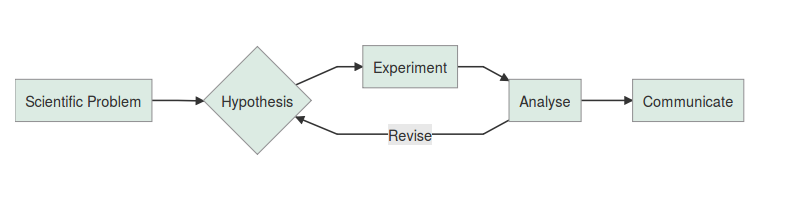

## A reproducibility crisis

- But all research is reproducible right?
- 
@Colquhoun2014

## Where does it go wrong?



## p-values

```{r,echo=FALSE,eval=FALSE}

library("DiagrammeR")

diagram <- "
graph LR
A[bla]-->B[bla]
B-->C[bla]
B-->D[bla]
A-->E[bla]
E-->F[bla]
E-->G[bla]

style A fill:#DCEBE3
style B fill:#DCEBE3
style C fill:#DCEBE3
style D fill:#DCEBE3
style E fill:#DCEBE3
style F fill:#DCEBE3
style G fill:#DCEBE3
"


mermaid(diagram)


```

## A statistical crisis


```{r,echo=FALSE,eval=FALSE}

library("DiagrammeR")

diagram <- "
graph LR
A[Scientific Problem]-->B{Hypothesis}
B-->C[Experiment]
C-->D[Analyse]
D-->|Revise|B
D-->E[Communicate]

style A fill:#DCEBE3
style B fill:#DCEBE3
style C fill:#DCEBE3
style D fill:#DCEBE3
style E fill:#DCEBE3
"

mermaid(diagram)


```

## Slide with Bullets

- Bullet 1
- Bullet 2
- Bullet 3

## What can we do about it?

```{r}
summary(cars)
```

## Slide with Plot

```{r, echo=FALSE}
plot(cars)
```

## References
